# Lista de tareas

```md
## Tareas

### Lista de tareas

| Orden | Tarea                                      | Duración (hs) | Dependencias |
|----------|--------------------------------------------------|:-----------------:|:-----------------:|
| a        | Estructurar documentación del proyecto           | 4                 | -                 |
| b        | Crear diagramas UML principales                  | 6                 | a                 |
| c        | Configurar base del Backend (proyecto + MySQL)   | 5                 | b                 |
| d        | Implementar Core (Models, DTOs, IServices)       | 8                 | c                 |
| e        | Implementar capa Data (DbContext, repositorios)  | 7                 | d                 |
| f        | Implementar capa Services (lógica de negocio)    | 8                 | e                 |
| g        | Implementar autenticación JWT                     | 4                 | f                 |
| h        | Habilitar y probar JWT en Swagger                 | 2                 | g                 |
| i        | Crear API (Controllers + CRUD + Validaciones)     | 10                | f, h              |
| j        | Configurar Frontend (rutas, axios, login)         | 8                 | i                 |
| k        | Implementar pantallas principales del Frontend    | 10                | j                 |
| l        | Integración completa Frontend + Backend           | 6                 | k                 |
| m        | Testing general (flujo, endpoints, UI)            | 6                 | l                 |
| n        | Documentación final                               | 3                 | m                 |
```

---

# Diagrama de Gantt 

```mermaid
gantt
    title Proyecto: NetViTeca
    dateFormat  HH
    axisFormat  %Hh

    section Documentación
    a : a, 00, 4h
    b : b, after a, 6h

    section Backend - Configuración
    c : c, after b, 5h

    section Backend - Desarrollo
    d : d, after c, 8h
    e : e, after d, 7h
    f : f, after e, 8h

    section Seguridad
    g : g, after f, 4h
    h : h, after g, 2h

    section API
    i : i, after f h, 10h

    section Frontend
    j : j, after i, 8h
    k : k, after j, 10h

    section Integración y Pruebas
    l : l, after k, 6h
    m : m, after l, 6h

    section Cierre
    n : n, after m, 3h
```

