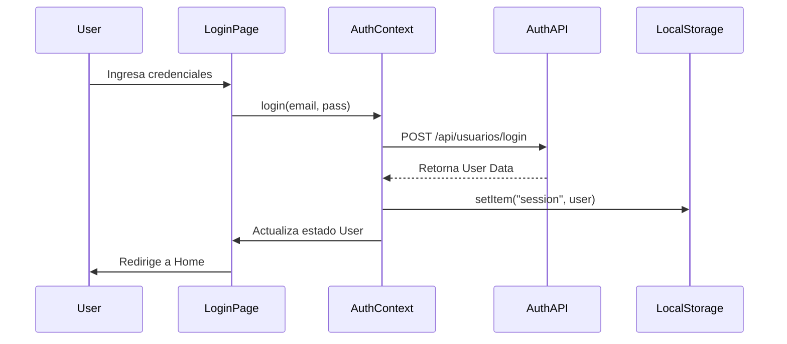

# Flujo de Datos del Frontend 🔄

Este documento describe los flujos de interacción principales dentro de la aplicación cliente de NetViTeca.

## 1. Autenticación (Login) 🔐

El sistema utiliza persistencia de sesión basada en `localStorage` para mantener al usuario conectado.

1.  **Entrada:** El usuario ingresa credenciales en `Login.tsx`[cite: 701].
2.  **API Call:** Se llama a `authApi.login(email, password)`[cite: 720].
3.  **Backend:** Valida y retorna el objeto usuario (id, username, email).
4.  **Contexto:** `AuthProvider` recibe la respuesta, actualiza el estado `user` y guarda la sesión en `localStorage`[cite: 561].
5.  **Redirección:** Al detectarse un usuario en el estado, el router redirige a la página principal (`/`)[cite: 701].

### Diagrama de Secuencia de Login

## 2. Gestión de Biblioteca (Agregar Libro) 📚

El flujo para agregar un libro combina la API con una actualización optimista de la UI.

    Catálogo: Catalogo.tsx carga los libros disponibles usando booksApi.getAvailable.

Interacción: El usuario hace clic en "Agregar a mi biblioteca" en una BookCard.

Contexto: Se invoca addBook(book) del MyBooksContext.

API Call: Se ejecuta booksApi.addToLibrary(userId, bookId).

    Actualización UI:

        El contexto actualiza el estado local myBooks agregando el libro inmediatamente (Optimistic Update).

        La página de Catálogo filtra el libro agregado para que ya no aparezca como "disponible".

## 3. Actualización de Perfil 👤

### Permite al usuario modificar sus datos personales.

    Vista: En MiPerfil.tsx, el usuario activa el modo edición.

### Formulario: ProfileForm maneja los inputs y validaciones locales.

Guardado: Al enviar, se llama a authApi.updateProfile.

    Sincronización: Si la API responde con éxito, se actualiza el AuthContext y el localStorage con los nuevos datos para reflejar los cambios en toda la app (ej. Navbar) sin recargar.

## 4. Ciclo de Vida de los Datos ⏳

    Carga Inicial: Al cargar la app (main.tsx), el AuthProvider verifica si hay una sesión guardada. Si existe, restaura el usuario. Inmediatamente, MyBooksProvider detecta el usuario y carga sus libros en segundo plano.

Manejo de Errores: Las llamadas a la API están envueltas en bloques try/catch. Los errores de red o validación se muestran mediante alert o mensajes en la UI (ej. en CreateBook.tsx).